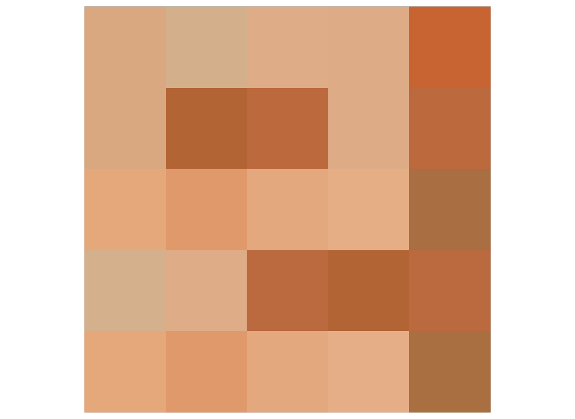

# Color Space Test -- MaterialX in OpenUSD

These files test color management in MaterialX files used in OpenUSD.

The tests are all based on the file `color_test.mtlx` which is a 5x5 grid of squares, each
with a different color space related test. The desired result is that the render is a solid
orange color of [200, 100, 50] (with the sRGB transfer function applied and rounded to 8-bits).
This expects a rendering space of Linear Rec.709 (`lin_rec709_scene`).

The color space names used in this file are the names that are current as of MaterialX 1.39.4.
OpenUSD is able to convert these to the official Color Interop Forum names.

The screenshots below were generated via `usdrecord`, with the default arguments. This was
using the dev branch of OpenUSD as of 2025-12.

## Importing MaterialX by reference

[mtlx_color_test_ref.usda](./mtlx_color_test_ref.usda)

This file imports a .mtlx file by reference, therefore using OpenUSD's MaterialX plug-in to
convert MaterialX into USD Shade. The test is partially successful, however, there are several 
problems. By running usdcat on the .mtlx file, it is apparent that the problems are due to the
way the plug-in loaded the file, rather than the rendering:

1.  It skips over the embedded nodegraph "NG_switch5". This is why the top row is black.

2.  For elements that are tagged with the document level color space "lin_displayp3",
    no color space is authored and yet there is no USD document level color space set to define
    the scope for those elements. This is why four of the squares are a different orange.

## External conversion of MaterialX to USD Shade

[mtlx_color_test_maya.usda](./mtlx_color_test_maya.usda)

To work around the issues with the OpenUSD MaterialX plug-in, the MaterialX file was read into
Maya and then exported as USD. This works around both issues mentioned above and Storm is
then able to render the intended result.

## External conversion of MaterialX to USD Shade using the UsdColorSpaceAPI

[mtlx_color_test_maya_csapi.usda](./mtlx_color_test_maya_csapi.usda)

The above test assigns the color spaces via colorSpace metadata. This test is identical
except it assigns color spaces via the new UsdColorSpaceAPI. In this case, none of the tests
are successful, likely because Storm is not set up to use the new API yet.

## License Information

Copyright 2025 Autodesk

CC-BY 4.0 https://creativecommons.org/licenses/by/4.0/
