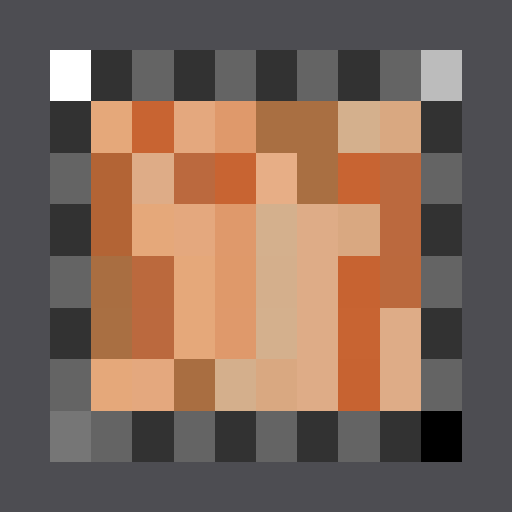
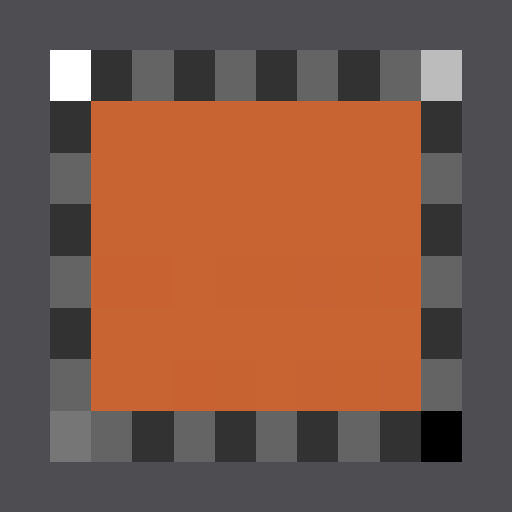
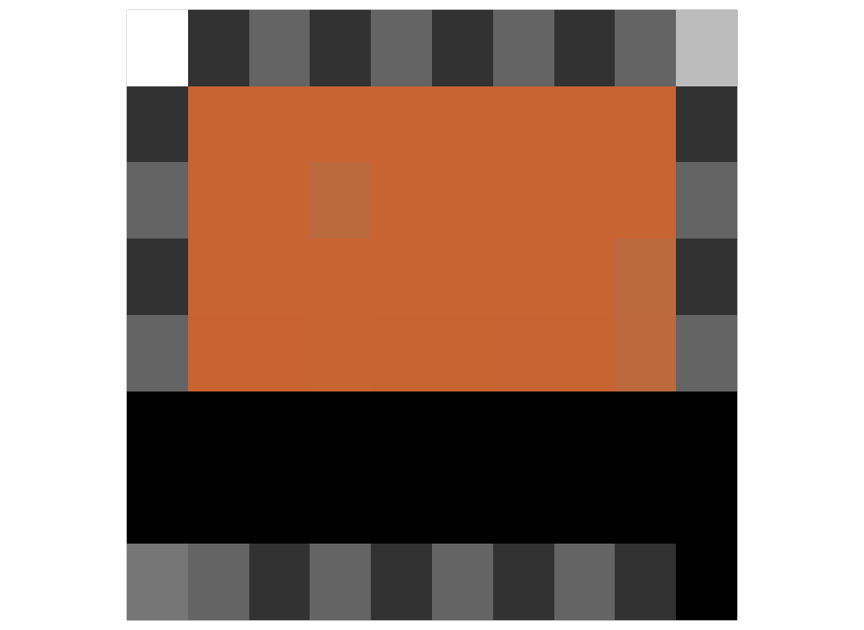
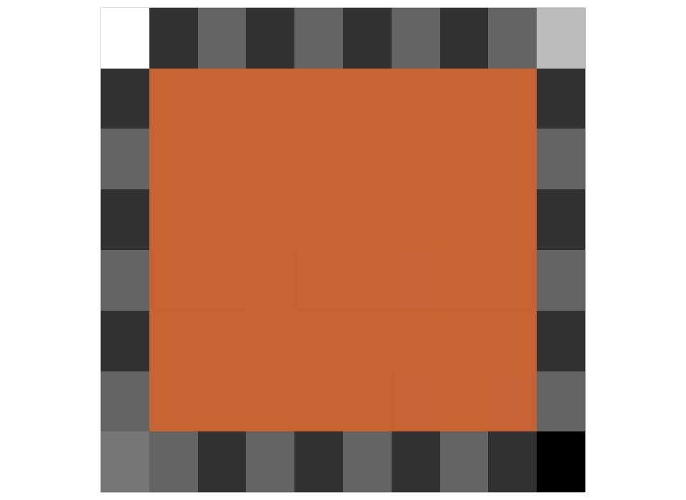
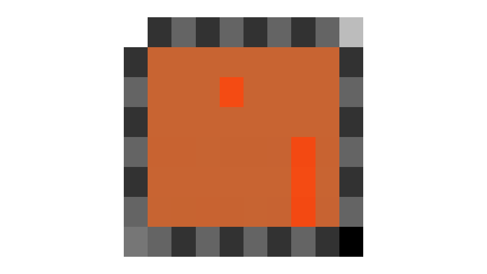
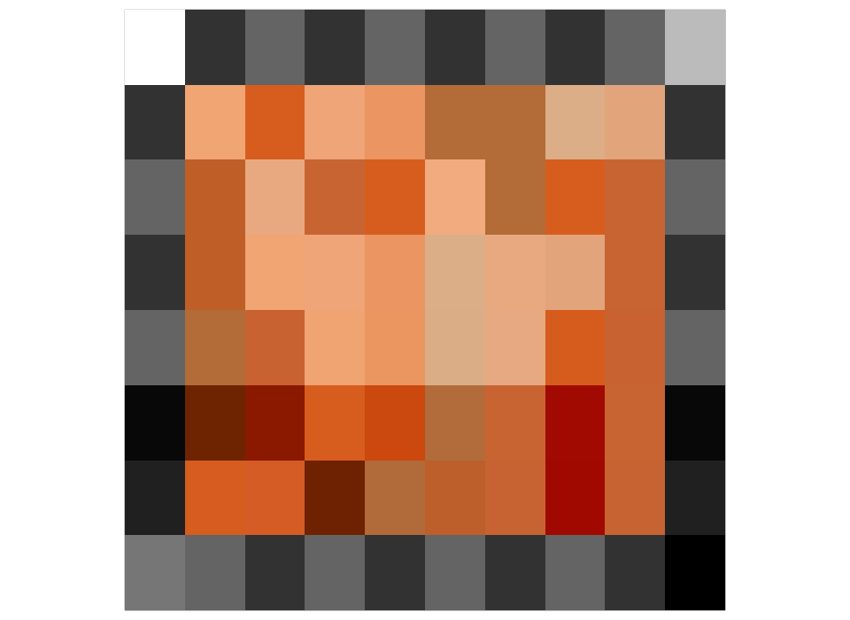

## Color Space Tests -- MaterialX in OpenUSD

These files test color management in MaterialX, as used on their own and in OpenUSD.

The tests are all based on the file `orange_squares_8x6_lin_rec709.mtlx` which is an eight by six grid of orange squares, each with a different color-space-related test. The central region is surrounded by a gray checkerboard to provide orientation and a way to visually locate individual squares. The desired result is that the central region should render as a solid orange color.

The test file is designed to be rendered using the "Scene-linear Rec.709" rendering color space. This would be a color interop ID of "lin_rec709_scene" (or "lin_rec709" in the earlier MaterialX nomenclature). After rendering, the image should be saved in "sRGB Encoded Rec.709 (sRGB)" color space (the interop ID is "srgb_rec709_scene") with no tone-mapping. In other words, the rendered result should have the sRGB transfer function applied for ease of evaluation.

For the test to be considered passing, the RGB value of the entire central orange region should be {200, 100, 50}, within plus or minus one 8-bit code value, when save to an integer-based file format such as PNG. The correct value in the "lin_rec709_scene" rendering color space is {0.577580, 0.127438, 0.0318960}, if saved directly to an OpenEXR file, with no color conversion.

The material should be mapped onto a square plane. It uses the `emission_color` input of a `surface_unlit` surface shader material, so no scene lighting is needed (or desired) in order to obtain the expected aim values.

This is what the target looks like with color management turned off:

And here is what it should look like with color management turned on and working properly:

Both of the images were generated using the renderer built into MaterialX and so obtaining the second image is possible with `MaterialXView`. The solid gray band around the outside was added as part of the render and is not part of the material itself (as will be seen below).

For the color spaces used in this test, the same result is provided by MaterialX using both the DefaultColorManagementSystem and the OcioColorManagementSystem, with the latter using the CG config for ACES that is built into the OCIO library.

The following table shows the color space used for each sub-square within the orange region. The first three rows test the case of an RGB literal color (a single RGB value). The fourth row tests color spaces assigned to images. The referenced images are 1x1 pixel in dimension and are in the HDR (Radiance) file format. The images are provided in the `textures` sub-directory. The next row tests the use of RGB literals within a Node Graph. The last row tests the use of images within a Node Graph. 

Values listed as "untagged" means that there is no colorspace attribute present. This tests the hierarchical nature of color spaces in MaterialX. Items without a color space inherit the color space of the surrounding scope. For the first four rows, that is from the MaterialX document itself, which is declared as "lin_displayp3". For the next two rows, that is the color space of the Node Graph, which is "srgb_displayp3".

The color space names used in this file are the names that are supported in MaterialX 1.39.5. The test includes some Color Interop Forum names (such as used in OpenUSD), as well as some earlier MaterialX names. However, the test does not include Color Interop Forum names that are not currently supported in MaterialX. (Although there is now a MaterialX PR that will add full support: #3042.)

| Test  type | column 1 | column 2 | column 3 | column 4 | column 5 | column 6 | column 7 | column 8 |
| :---- | :---- | :---- | :---- | :---- | :---- | :---- | :---- | :---- |
| RGB literal | srgb\_texture | lin\_rec709 | g22\_rec709 | g18\_rec709 | acescg | lin\_ap1 | g22\_ap1 | adobergb |
| RGB literal | lin\_adobergb | srgb\_displayp3 | lin\_display-3 | none | rec709\_display | lin\_ap1\_scene | lin\_rec709\_scene | lin\_p3d65\_scene |
| RGB literal | lin\_adobergb\_scene | srgb\_rec709\_scene | g22\_rec709\_scene | g18\_rec709\_scene | g22\_ap1\_scene | srgb\_p3d65\_scene | g22\_adobergb\_scene | untagged |
| Image | lin\_ap1\_scene | lin\_p3d65\_scene | srgb\_rec709\_scene | g18\_rec709\_scene | g22\_ap1\_cene | srgb\_p3d65\_scene | none | untagged |
| Nodegraph RGB literal | lin\_ap1\_scene | lin\_p3d65\_scene | srgb\_rec709\_scene | g18\_rec709\_scene | g22\_ap1\_cene | srgb\_p3d65\_scene | none | untagged |
| Nodegraph image | srgb\_texture | g22\_rec709 | acescg | g22\_ap1 | adobergb | srgb\_displayp3 | none | untagged |

The following images (except the ACEScg one) were generated in OpenUSD/Hydra version 26.05 using `usdrecord` and a similar image is possible in `usdview`. Note that one must use the `–disableCameraLight` option to obtain the intended result.

### Importing MaterialX by reference

[mtlx_by_reference.usda](./mtlx_by_reference.usda)

The test file `mtlx_by_reference.usda` simply imports the `orange_squares_8x6_lin_rec709.mtlx` file by reference and maps it to a plane. As of OpenUSD version 26.05, the test is partially successful, however there are several problems. By running `usdcat` on the .mtlx file, it is apparent that the problems are due to the way the plug-in loaded the file, rather than the rendering:

1. It skips over the embedded node graphs. This is why the two rows are black.

2. For elements that are tagged with the document level color space “lin_displayp3”, no color space is authored on those individual elements and yet there is no functional USD document level color space that defines the scope for those elements (the customLayerData at the top of the document seems to be ignored). Items untagged with a color space have the same problem. This is why three of the squares are a different orange.

### External conversion of MaterialX to USD Shade

[orange_squares_8x6_lin_rec709.usda](./orange_squares_8x6_lin_rec709.usda)

To work around the issues with the OpenUSD MaterialX plug-in, the `orange_squares_8x6_lin_rec709.mtlx` file was hand-converted to OpenUSD, using a combination of `usdcat` and Maya as a starting point, followed by some hand editing. This then renders correctly in `usdrecord` and `usdview`.

### External conversion of MaterialX to USD Shade -- Rendered in ACEScg

As mentioned above, this target was intended to be rendered in Linear Rec. 709. Here is what it looks like if the render is performed in ACEScg (not using Storm) and then followed by a post-render conversion to "srgb_rec709_scene". All of the squares that are explicitly tagged with a color space, or inherit the color space of the surrounding scope, have the correct value. However the four squares that were tagged "none" (for no color management) now look more saturated. This is not an error, it is the expected result since "none" essentially means "this color is already in the rendering space" and the rendering space now has a wider gamut. 

Note that the Color Interop Forum "data" color space name used in OpenUSD is not currently supported in MaterialX (but will be added as part of PR #3042) and so it is not present in the current test.

### External conversion of MaterialX to USD Shade using the `UsdColorSpaceAPI`

[orange_squares_8x6_lin_rec709_csapi.usda](./orange_squares_8x6_lin_rec709_csapi.usda)

The `orange_squares_8x6_lin_rec709.usda` file mostly assigns the color spaces via `colorSpace` metadata (although the `UsdColorSpaceAPI` is used to define the color space on a scope to be used with untagged items). The test in `orange_squares_8x6_lin_rec709_csapi.usda` is the same except it only assigns color spaces via the `UsdColorSpaceAPI`. In this case, none of the tests are successful, likely because Storm is not set up to fully use the new `UsdColorSpaceAPI` yet.

### License Information

Copyright 2026 Autodesk

CC-BY-ND 4.0 https://creativecommons.org/licenses/by-nd/4.0/
