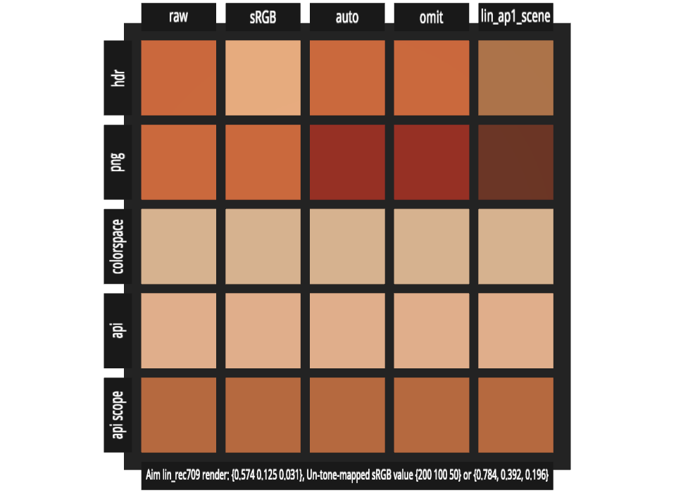

# Color Space Tests -- UsdPreviewSurface

These files test color management in OpenUSD's UsdPreviewSurface.

## Assigning a Color Space to Textures

UsdPreviewSurface uses UsdUVTexture for loading textures from image files. There are multiple
methods of assigning a color space to a UsdUVTexture:

1.  Using the `sourceColorSpace` input attribute.

2.  Setting `colorSpace` as metadata on the `file` input attribute.

3.  Adding a `colorSpace:name` attribute on the `file` input attribute.

4.  Adding a `colorSpace:name` attribute to a scope enclosing the UsdUVTexture.

[usduvtexture_color_test.usda](./usduvtexture_color_test.usda)

This file tests all four of these possibilities. In addition, it tests what happens when 
`sourceColorSpace` exists along with one of the other options. The tests are arranged into
columns where `sourceColorSpace` is set as follows:

1.  Set to "raw".

2.  Set to "sRGB".

3.  Set to "auto".

4.  The attribute is omitted entirely (this should default to "auto").

5.  Set to "lin_ap1_scene". This is not a legal option for this attribute, but since it is
    a legal value as a `colorSpace`, one could imagine someone trying to set such a value.

The rows are set up as follows:

1.  Only use `sourceColorSpace` and use an .hdr file for the texture.

2.  Only use `sourceColorSpace` and use a .png file for the texture.

3.  Set `colorSpace` as metadata on the `file` input attribute, with a value "g22_ap1_scene".

4.  Set a `colorSpace:name` attribute on the `file` input attribute, with value "srgb_p3d65_scene".

5.  Set a `colorSpace:name` attribute on the enclosing scope, with value "lin_adobergb_scene".

The test is intended to be rendered in the color space "Linear Rec.709 (sRGB)", which has the
interop ID "lin_rec709_scene". The materials use UsdPreviewSurface emissiveColor, so no lights
are necessary to render it. There is a default camera set up.

If the test passes, all of the squares should have the value {200, 100, 50}, if an sRGB transfer
function has been applied in order to save the result as an integer image file. If the render is
saved in scene-linear space as an OpenEXR file, the aim value for all squares is {0.574 0.125 0.031}.

Currently, Storm is not giving the correct values except for a few squares near the upper left
part of the image.

At the moment, there does not seem to be a way to obtain the colorSpace from the enclosing
scope through Hydra, so Hydra-based renderers would not be able to get the fifth row correct.
However, there should be nothing blocking a Hydra renderer from getting the other four rows
correct.
